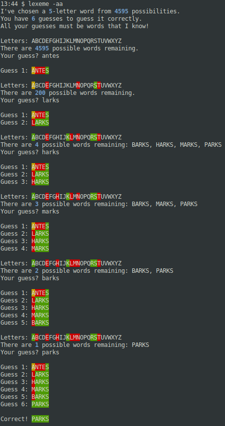

# What is this?

Python program to play a word-guessing game like
[Wordle](https://www.powerlanguage.co.uk/wordle), but…

- ***More addictive*** because you can play it over and over and over, not just once a day.
- Option for varying the word length (`-l`, `--length`) or number of guesses (`-g`, `--guesses`)
- Option to allow guesses that aren't known words (`-n`, `--nonsense`)
- Option to do guess-by-guess analysis, showing how many words you eliminate after each guess (`-a`, `--analysis`)
- Option to show time taken after every guess (`-t`, `--timer`)
- A bunch of unit tests to verify the logic
- Beautiful command-line text interface (😜)

## Running it

### Installation

Requires Python 3.x, the [`colorama` module](https://pypi.org/project/colorama)
for printing colored letters, and a file containing a list of possible
words.

Install with `pip3 install https://github.com/dlenski/lexeme/archive/main.zip`, then play the game with the command `lexeme`.

### Wordlists

The default wordlist is in `/usr/share/dict/words`, which
should exist on any desktop Unix system.

#### Collins Scrabble Word Lists

Alternatively, the [Collins Scrabble Word Lists](https://boardgames.stackexchange.com/questions/38366/latest-collins-scrabble-words-list-in-text-file)
seem to work nicely! The 2019 edition (CSW2019) contains 12,972 five-letter words, for example.

#### Wordle word lists

The wordlists used by Wordle itself are a bit unusual: Wordle has a short
list of words as possible answers (2315 words), but a much longer list of
additional words as allowed guesses (2315 possible answers + 10,657 additional
words, for a total of 12,972). They can be extracted with, say, these horrible
cURL+Perl one-liners:

```sh
curl https://www.powerlanguage.co.uk/wordle/main.db1931a8.js |
    perl -ne 'print join("\n", ($1=~/\w+/g)) . "\n" if /Aa=(\[[^]]+\])/' > wordle_possible_answers.txt
curl https://www.powerlanguage.co.uk/wordle/main.db1931a8.js |
    perl -ne 'print join("\n", ($1=~/\w+/g)) . "\n" if /La=(\[[^]]+\])/' | cat wordle_possible_answers.txt - > wordle_allowed_guesses.txt
```

### Options

```
usage: lexeme [-h] [-d DICT] [-g GUESSES] [-l LENGTH] [-n] [-a]

optional arguments:
  -h, --help            show this help message and exit
  -d DICT, --dict DICT  Wordlist to use, either an absolute path or a path
                        relative to /usr/share/dict. Default
                        /usr/share/dict/words.
  -g GUESSES, --guesses GUESSES
                        Maximum number of guesses to allow
  -l LENGTH, --length LENGTH
                        Length of word to guess
  -n, --nonsense        Allow nonsense guesses. (Default is to only allow
                        known words.)
  -a, --analyzer        Analyze remaining possible words, and show their
                        number after each guess. If repeated (cheater mode!),
                        it will show you all the remaining possible words when
                        there are fewer than 100
  -t, --timer           Show time taken after every guess.
```

## Screenshots

Example of gameplay, with analyzer (`-a`) and timer (`-t) enabled,
showing you the _number_ of possible remaining words, and the time taken
for each guess:


Example of cheater mode (`-aa`), show you all of the possible remaining words
after each guess, as long as there are ≤100 of them:



# Inspiration

- [Wordle](https://www.powerlanguage.co.uk/wordle), of course
- [@jsha](https://github.com/jsha)'s brilliant [Wordlyze](https://wordlyze.crud.net) ([source](https://github.com/jsha/learnrust/blob/master/wordle/src/main.rs) for the analyzer mode
- [The subtle handling of repeated letters](https://twitter.com/moxfyre/status/1477320939520020484) inspired the unit tests
